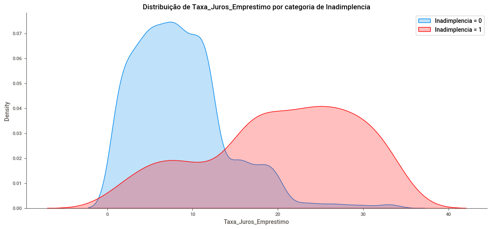
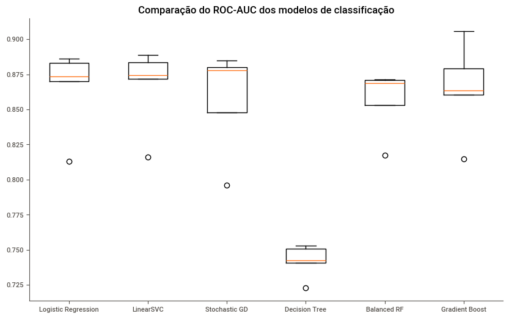
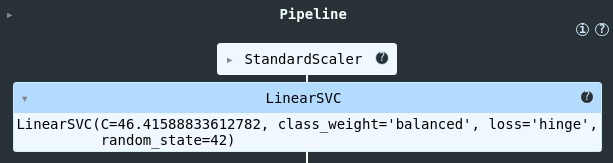

# Risco de Crédito

## 📌 Visão Geral

Este projeto foi realizado com o objetivo de analisar os dados de uma empresa de [ramo da empresa], tendo sido identificados os fatores que mais implicavam na inadimplência por parte dos clientes, desenvolvido um modelo preditivo e indicada uma possível solução para mitigar esse problema.

[📘 Notebook](https://github.com/Mathsnts18/risco_de_credito2/blob/main/notebooks/case_risco_de_credito.ipynb)

## 💼 Entendimento do Negócio

O crédito desempenha um papel crucial ao permitir que indivíduos e empresas acessem recursos para consumo, investimentos e expansão de atividades. Nesse contexto, compreender o perfil de risco dos clientes é fundamental para equilibrar a rentabilidade do negócio com a mitigação de inadimplências

Na concessão de crédito, o processo envolve avaliar a capacidade de pagamento do cliente por meio de critérios como histórico financeiro, renda, comprometimento de orçamento e garantias. Modelos preditivos e análise de dados são ferramentas indispensáveis para identificar clientes que apresentam maior probabilidade de honrar seus compromissos e aqueles que podem se tornar inadimplentes. Essa abordagem baseada em dados permite personalizar condições de crédito, como taxas de juros, limites e prazos, de acordo com o perfil de risco de cada cliente.
 
Além disso, o gerenciamento de carteiras de crédito requer estratégias proativas, como o acompanhamento contínuo do comportamento financeiro dos clientes e a oferta de renegociação para evitar perdas em caso de inadimplência. Por fim, ações como a educação financeira e o aconselhamento personalizado podem fortalecer a relação com o cliente, promovendo não apenas a redução de riscos, mas também a fidelização e o aumento da confiança na instituição.

## 📊 Análise Exploratória de Dados

[💾 Relatório - Faça o download](https://github.com/Mathsnts18/risco_de_credito2/blob/main/notebooks/SWEETVIZ_REPORT.html)

Foram realizadas análises completas das variáveis disponibilizadas, avaliando seus pormenores e aplicando tratamentos necessários.

Para automação do projeto, foi utilizado a biblioteca sweetviz para a criação do relatório. A análise revelou:

- **Inadimplencia**
    - Variável *Target*
    - Desbalanceada: 10% da base ficaram inadimplente.

- **Mês_Empréstimo**
    - O mês com a maior quantidade de emprestimo foi **abril**.
    - O mês com a menor quantidade de emprestimo foi **janeiro**.

- **ID_Cliente**
    - Variável identificadora

- **Idade**
    - 50% dos clientes tinham idade entre **26 e 44 anos**.

- **Profissão**
    - A base é bem distribuida entre as profissões.

- **Salário**
    - 50% dos clientes recebem um salário entre **R$2.001,00 a R$7.343,00**.

- **Taxa_Juros_Emprestimo**
    - 50% dos clientes tem uma taxa de até **8%**, mas há aproximadamente **25%** que tem uma taxa de mais de **12%**.

- **Núm_Empréstimos**    
    - A grande maioria dos clientes recorreram a um emprestimo pelo menos **4 vezes**.

- **Saldo_Devedor**
    - 50% dos clientes devem até **R$810,00**
    - 75% dos clientes devem até **R$1.264,00**
    - A clientes que devem até **R$4.998**

- **Pagamento_Minimo_Cartao**
    - **76%** dos clientes não optaram por usar o pagamento minimo do cartão.

### ℹ️ Information Value

Foram plotados gráficos de correlação de Pearson e de dispersão para entender como as variáveis se relacionavam entre si. No entanto, com a utilização da técnica de **Information Value (IV)**, foi possível investigar mais profundamente a relação das variáveis independentes com a variável *target*.

A técnica de Information Value (IV) nos fornece o "poder de separação" que uma variável qualitativa de duas ou mais categorias possui sobre outra variável binária.

| IV Total   | Poder de separação                      |
| ---------- | --------------------------------------- |
| < 0,02     | Muito fraco                             |
| 0,02 a 0,1 | Fraco                                   |
| 0,1 a 0,3  | Médio                                   |
| 0,3 a 0,5  | Forte                                   |
| > 0,5      | Comportamento suspeito                  |

Identificamos em nosso dataset variáveis com um ótimo poder de separação em relação à variável target, Inadimplência, como:
- `Taxa_Juros_Emprestimo`;
- `Saldo_Devedor`;
- `Núm_Empréstimos`;
- `Pagamento_Minimo_Cartão`;
- `Salário`
 
Cada uma dessas variáveis foi avaliada detalhadamente para compreender melhor o perfil dos clientes.

## 🛠 Pré-Processamento

O pré-processamento de dados é uma etapa crucial em projetos de *machine learning*. Para garantir a eficácia e reprodutibilidade do nosso processo, utilizamos o **Pipeline** do *Scikit-learn*. O uso de um pipeline assegura que as transformações aplicadas aos dados de treinamento sejam reproduzidas de forma idêntica nos dados de teste, eliminando potenciais erros e inconsistências.

Durante o processo, foram excluidas as colunas `Inadimplencia`, `ID_Cliente`, `Mês_Empréstimo` e `Profissão` que apresentaram baixo poder preditivo em relação ao *target*. Além disso, os dados foram padronizados para otimizar o desempenho dos modelos.

## 🤖 Treinamento dos Modelos de *Machine Learning*

Foram treinados **seis classificadores diferentes**, com a métrica ROC-AUC (área sob a curva característica de operação do receptor) sendo priorizada para a avaliação de desempenho.

Os modelos apresentaram os seguintes resultados:

| Modelo | Média | Desv. Padrão |
| ------ | ----- | ------------ |
| Logistic Regression | 0.8651 | 0.0267
| LinearSVC | 0.8669 | 0.0261 |
| Stochastic GD | 0.8574 | 0.0333 |
| Decision Tree | 0.7421 | 0.0107 |
| Balanced RF | 0.8562 | 0.0207 |
| Gradient Boost | 0.8646 | 0.0297 |

Entre os modelos testados, o Decision Tree apresentou o menor desempenho, com uma média de ROC-AUC significativamente inferior aos demais. Já os modelos LinearSVC e Logistic Regression obtiveram os melhores resultados de ROC-AUC, além de apresentarem as menores variações.

Optarei pelo modelo LinearSVC, devido à sua leve vantagem tanto na média quanto no desvio padrão em relação aos demais.

### 🔎 Ajuste dos Hiperparâmetros

Com a ajuda do `RandomizedSearchCV` do *Scikit-learn*, o modelo escolhido foi exaustivamente otimizado para identificar o melhor conjunto de hiperparâmetros. Essa abordagem permitiu testar várias combinações de parâmetros de forma eficiente, maximizando o desempenho do modelo sem comprometer o tempo de execução.

## 💰 Análise Financeira

Com o modelo preditivo criado, é possível desenvolver uma estratégia individualizada de aconselhamento, com o objetivo de encorajar os clientes com alto risco de inadimplência a pagar suas dívidas a tempo. Caso isso não seja viável, podem ser oferecidas opções de pagamento alternativas. O custo por aconselhamento é de R$ 200,00, e a taxa de sucesso esperada é de 70%.

Com o modelo preditivo implementado, conseguimos mitigar **R$ 20.224,24** no conjunto de teste, resultando em uma economia de aproximadamente **25%** em relação ao cenário sem intervenção.

## ✅ Conclusão geral

Após uma análise profunda das métricas de desempenho e das análises financeiras, os seguintes pontos foram observados:

1. **Métricas de Desempenho**
    - O **Modelo Treinado** apresentou:
        - **ROC-AUC** de 0.87, sugerindo um boa capacidade de discriminação
        - **Precisão** de 0.63, indicando que, dos clientes previstos como inadimplentes, o modelo acertou 63%
        - **Recall** de 0.74, indicando que, dos clientes que inadimpliram, o modelo conseguiu captar 74%
        - **F1-score**, uma métrica que combina precisão e recall, o modelo obteve um valor de 0.68.

2. **Performance Financeira**
    - Com base em uma estratégia de aconselhamento, modelo treinado obteve uma economia de quase **25%** em nosso dataset de teste, economizando **R$20.224,24** no saldo médio utilizando um **threshold de -0.1086**.

A implementação de um modelo de **Machine Learning** contribui na detecção e prevenção de inadimplência, além de trazer um potencial ganho financeiro.
